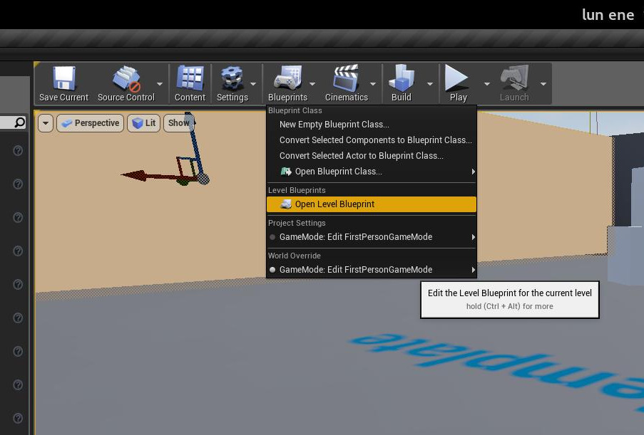
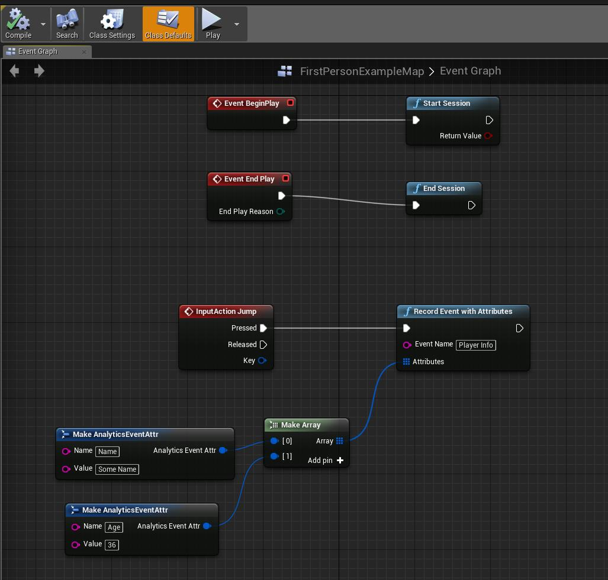
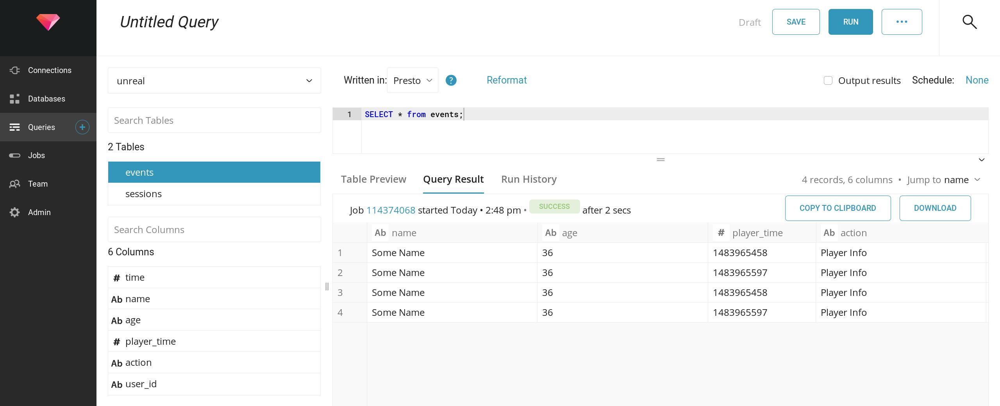

# Treasure Data Analytics Plugin for Unreal Engine 4

This plugin behaves as an Analytics Provider for Unreal Engine 4.

## Requirements

- Unreal Engine 4.22
- [Treasure Data Write-Only API Key](https://console.treasuredata.com/app/users) (Click on User > API Keys)

## Getting Started

The following document assumes that the current Unreal Engine have been compiled from sources or it have all dependencies so third party plugins can be build.

### Download and place the plugin

Get a copy of the plugin from the main GIT repository:

```
$ git glone http://github.com/treasure-data/td-ue4-sdk
```

Switch to UE-4.22 branch:

```
$ git checkout UE-4.22
```

Copy the new __td-ue4-sdk__ to your Engine plugins folder, the target path looks like:

```
UnrealEngine/Engine/Plugins/td-ue4-sdk
```
> Alternative you can copy the plugin content inside your Project Plugin directory, not that this approach don't work on Linux Development environment.

### Build the plugin

To build the plugin is required to generate the build-rules, for the purpose the UE4 Engine provides a script called __GenerateProjectFiles__:

- GenerateProjectFiles.bat
- GenerateProjectFiles.sh

Depending of the system (Unix bases or Window), run the proper script from the command line:

- If the plugin is inside the Project directory (Project/Plugins), go to the Project root directory and run the script.
- If the plugin is inside the Engine, run the command from the Unreal Engine source root directory.

Once the command have finished, type the _make_ command:

```bash
$ make
```

After a few seconds the plugin binary should be available.

#### Speed up plugin build phase

In some cases is required to re-build only the plugin, using a normal _make_ command can take some minutes as it does some parsing running some scripts to fix dependencies, to speed up the process the following options can be added:

```bash
$ make UE4Editor ARGS=-canskiplink
```

### Enable the Analytics plugins for your project

Inside the Unreal Engine 4 Editor, open your project and the _plugins_ window:

- Edit > Plugins

Now enable the two required plugins:

- Blueprints: located at Built-in > Analytics 
- Treasure Data: located at Installed > Analytics 

### Configure Project settings

From your project directory, open and edit the file _Config/DefaultEngine.ini_ and append the following content at bottom:

```
[Analytics]
ProviderModuleName=TreasureData
TDApiKey=TD-WRITE-ONLY-KEY
TDDatabase=DATABASE_NAME
SendInterval=10

[AnalyticsDevelopment]
ProviderModuleName=TreasureData
TDApiKey=TD-WRITE-ONLY-KEY
TDDatabase=DATABASE_NAME
SendInterval=10

[AnalyticsTest]
ProviderModuleName=TreasureData
TDApiKey=TD-WRITE-ONLY-KEY
TDDatabase=DATABASE_NAME
SendInterval=10
```

Save the file and restart Unreal Engine Editor.

### Gather metrics through Blueprints

In the Editor, click on the Blueprints dropdown menu and click on the _Open Level Blueprint_ option:



Now in the Event graphs, different events can be connected to Analytics functions, as an example the following image demonstrate how to track the _Session Start_, _Session End_ and _Record Event w/Attributes_ events:



After a Game starts, the plugin will send the events to Treasure Data.

## Treasure Data

In order to query the game events, go to the [Treasure Data Console](http://console.treasuredata.com), click on the _Databases_ item (left menu) and open the database used in the game (Config/DefaultEngine.ini > TDDatabase):


By default two tables are created:

- Sessions: start and stop sessions
- Events: All events with or without attributes.

To query records just click on any table name and click on the _Query_ top button. By default you can issue a SQL query like:

```
SELECT * from events;
```


